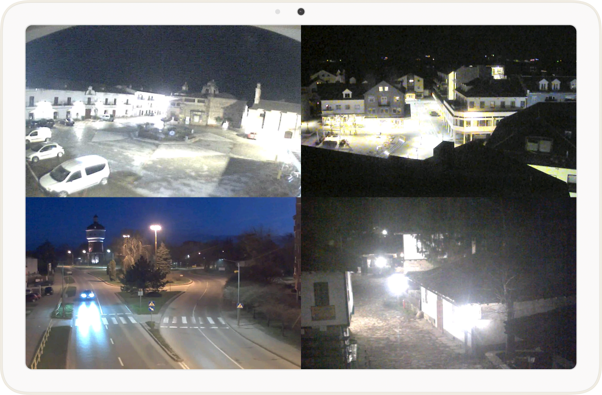

# Periscope for Frigate NVR



Upcycle your old Android tablet into a live viewer for Frigate NVR and hang it on a wall.\
**Note**: This is not a full Frigate client, it's only a live view.

➡️ [Check out Periscope v0.2 review by @mostlychris][yt-review]

[][yt-review]

## Compatibility
- **Android:** 2.2 and up (also Android TV)

## Play Protect note
Some releases are falsely marked as harmful by Play Protect.

During the installation, you might need to tap **`More details` → `Install anyway`**, or temporarily disable Play Protect in the Play Store.

## Home Assistant Operating System (HAOS)

To use Periscope with the Frigate HAOS add-on, you need to expose a port.

1. Open the HAOS web interface.
2. Navigate to:  
   **Settings → Add-ons → Frigate → Configuration**
3. In the **Network** section, enable **Show disabled ports**.
4. Map the port of either:
   - **Authenticated Web interface**  
   - **Unauthenticated Web interface**  

Then use that port and your HAOS IP in Periscope settings.

## FAQ

### How to setup a connection?
Fill in the host field (IP or domain), port, and protocol. HTTPS is supported on Android 4.1 and later.
If you're using the authenticated port, fill in the user and password fields, otherwise leave them empty.

### How to set up Birdseye?
Make sure you have Birdseye and restream enabled in Frigate's config:
```
birdseye:
  enabled: true
  restream: true
```
**birdseye** should then appear in the camera list.

### What's the difference between single-threaded and multi-threaded display implementation?
Apart from threading, multi-threaded display uses less memory but suffers from minor visual glitches. There are more implementation nuances.

Choose the one that works best for you.

### JPG or WEBP?
It's a network vs CPU tradeoff. WEBP can work on slower networks but uses more CPU, especially on the server. WEBP is supported on Android 4.4 and later.

### What is the timeout setting?
Specifies how long to wait for a response from Frigate before displaying the loading indicator.

### What is autostart?
Periscope can start automatically after booting up the device. This is especially useful if you disable the lock screen in the developer settings. Android >= 10 requires additional permissions. Autostart probably won't work on Android >= 13, and it's better to disable it then.


## TODO
- Adaptive resolution
- RTSP(S) support

[yt-review]: https://www.youtube.com/watch?v=KiajZnkMgUQ "Click to watch the review"

## ❤️ Sponsor
If you like **Periscope**, please consider [becoming a sponsor](https://github.com/sponsors/maksz42)!
